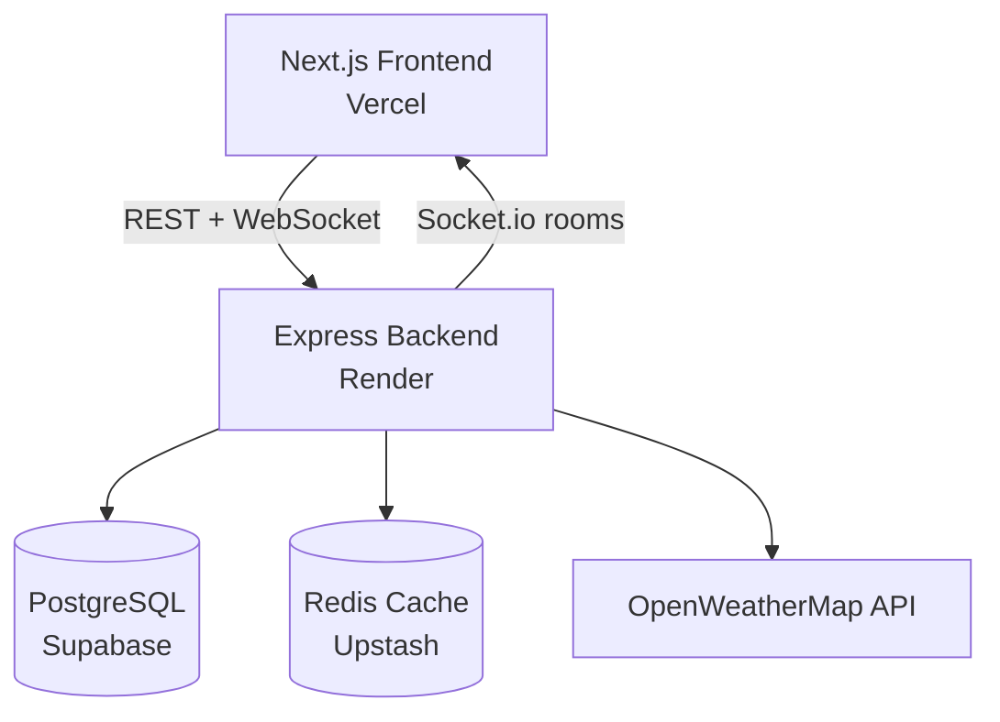

# Collaborative Trip Planner

A real-time, full-stack group trip planning app. Set a budget, share preferences, and get live destination recommendations your whole group can agree on — powered by a custom weighted decision engine and synced instantly across everyone in the group.

**Live demo:** [FRONTEND-URL](https://collaborative-trip-planner-beta.vercel.app/)
**Backend API:** [BACKEND-URL](https://collaborative-trip-planner.onrender.com)

> Note: the backend runs on a free tier that spins down after inactivity. The first request after idle time may take 30–60 seconds to respond while it wakes up.

---

## Try it yourself

You can create your own group from the homepage, or explore this live demo group without signing up anything real:

1. Visit [FRONTEND-URL](https://collaborative-trip-planner-beta.vercel.app/)
2. Click **Join Group**
3. Demo Group ID: `[021ceec7-0b04-44a1-ba31-62b7cc81b504]`
4. Name: `[demo]` · Email: `[demo@gmail.com]`

This is a real, shared, live group in the production database — not a sandboxed copy. Feel free to drag sliders, add destinations, or add suggestions; you're welcome to explore, but keep in mind other visitors may be interacting with the same group at the same time, since everything updates in real time for everyone using it.

---

## Screenshots
1. Homepage:
<p align="center">

</p>
2. Group Dashboard:
<p align="center">

</p>
3. Ranked Shortlist:
<p align="center">

</p>
4. Profile / Owner Panel:
<p align="center">

</p>

## Features

- **Live, multi-user sync** — every group member's preference changes update everyone's view instantly via WebSockets, no refresh needed.
- **Custom decision engine** — filters destinations by hard budget/travel-time constraints, then scores the rest against each member's individual tag preferences and personal budget comfort, averaging into a group ranking.
- **Real weather data** — also shows live forecasts of each destinations, cached in Redis to avoid redundant API calls.
- **Destination shortlisting** — browse suggestions from a shared pool or add any of your favourite destination (geocoded automatically).
- **Group ownership controls** — the creator of group can adjust the group's budget, travel-time limit, and origin location after creation.
- **Multi-currency support** — each group picks its own currency at creation.

## Tech stack

**Frontend:** Next.js (App Router), TypeScript, Tailwind CSS, Shadcn UI, Socket.io client
**Backend:** Node.js, Express, TypeScript, Socket.io
**Database:** PostgreSQL (Supabase), Prisma ORM
**Caching:** Redis (Upstash)
**External APIs:** OpenWeatherMap (forecasts + geocoding)
**Testing:** Vitest (unit tests for the decision engine)
**Deployment:** Vercel (frontend), Render (backend)

## Architecture



The backend's decision engine (`backend/src/engine/`) is a pure, dependency-free TypeScript module — no database or framework imports — so it can be unit tested in isolation. An adapter layer (`backend/src/adapters.ts`) translates between Prisma's database types and the engine's own input/output shapes.

## Local development

```bash
git clone https://github.com/[GITHUB-USERNAME]/collaborative-trip-planner.git
cd collaborative-trip-planner
```

**Backend:**
```bash
cd backend
npm install
# Create a .env file with:
# DATABASE_URL, DIRECT_URL, OPENWEATHER_API_KEY,
# UPSTASH_REDIS_REST_URL, UPSTASH_REDIS_REST_TOKEN
npx prisma db push
npx prisma db seed
npm run dev
```

**Frontend** (in a separate terminal):
```bash
cd frontend
npm install
# Create a .env.local file with:
# NEXT_PUBLIC_API_URL=http://localhost:3000
npm run dev
```

## Testing

```bash
cd backend
npm test
```

Covers the decision engine's geo-distance math, hard-constraint filtering, preference/budget scoring, and end-to-end ranking — 20+ tests.

## Known limitations

This was built as a learning project, and a few things are deliberately simplified:

- **No real authentication** — identity is just a name/email pair, matched by email, stored in the browser's local storage. Not secure, not meant to be.
- **Travel time is estimated**, not routed — straight-line distance divided by an assumed average speed, not real flight/driving data.
- **Currency is a display label only** — switching currencies (locked at group creation) does not convert existing costs.
- **Owner-only actions aren't server-enforced** — the backend trusts the frontend to only expose owner controls to the actual owner.
- **No group size limit** and no upper cap on number of destinations in a shortlist.

## License

Built as a personal learning project. Feel free to explore the code.
