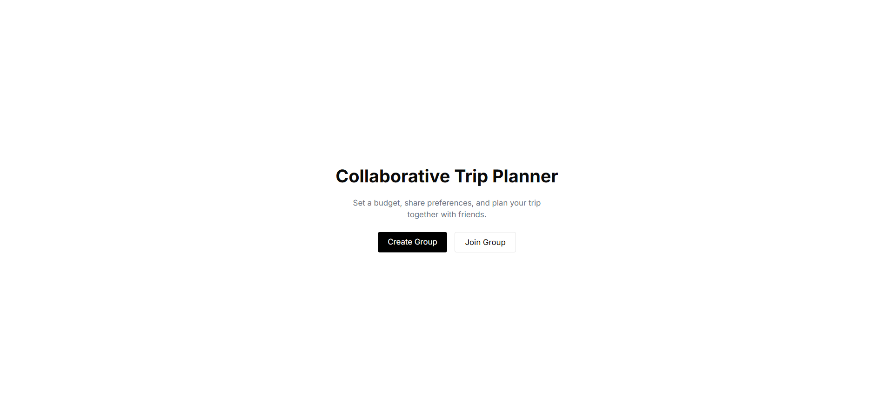
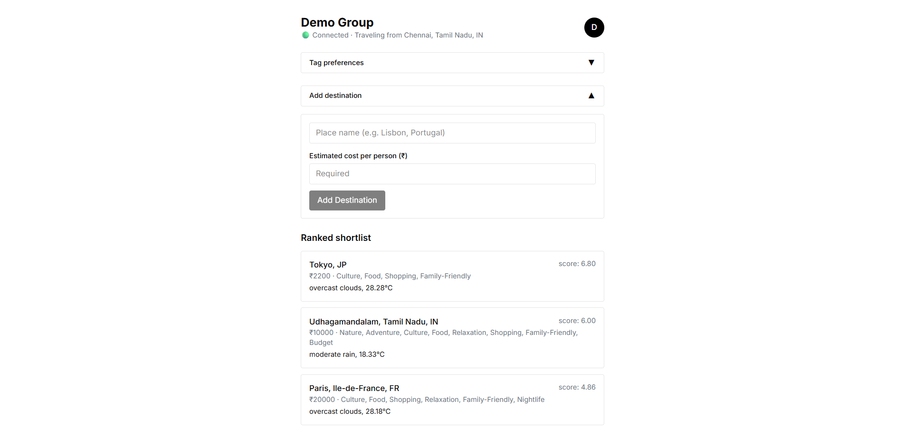
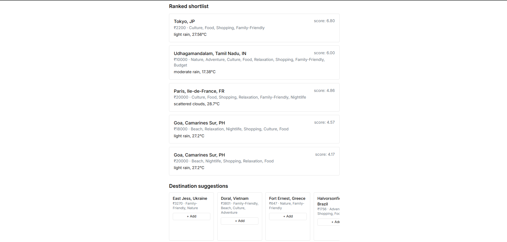
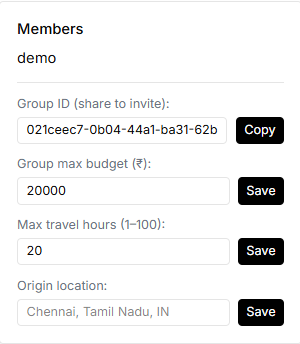

# Collaborative Trip Planner

A real-time, full-stack group trip planning app. Set a budget, share preferences, and get live destination recommendations your whole group can agree on — powered by a custom weighted decision engine and synced instantly across everyone in the group.

**Live demo:** [FRONTEND-URL](https://collaborative-trip-planner-beta.vercel.app/)
**Backend API:** [BACKEND-URL](https://collaborative-trip-planner.onrender.com)

> Note: the backend runs on a free tier that spins down after inactivity. The first request after idle time may take 30–60 seconds to respond while it wakes up.

---

## Try it yourself

You can create your own group from the homepage, or explore a live demo group without signing up anything real:

1. Visit [FRONTEND-URL](https://collaborative-trip-planner-beta.vercel.app/)
2. Click **Join Group**
3. Group ID: `[021ceec7-0b04-44a1-ba31-62b7cc81b504]`
4. Name: `[demo]` · Email: `[demo@gmail.com]`

This is a real, shared, live group in the production database — not a sandboxed copy. Feel free to drag sliders, add destinations, or add suggestions; you're welcome to explore, but keep in mind other visitors may be interacting with the same group at the same time, since everything updates in real time for everyone using it.

---

## Screenshots

| Homepage | Group Dashboard |
|---|---|
|  |  |

| Ranked Shortlist | Profile / Owner Panel |
|---|---|
|  |  |

*(Save your screenshots into a `docs/screenshots/` folder at the repo root, using these filenames — or rename yours to match, or edit the paths above to match your actual filenames.)*

---

## Features

- **Live, multi-user sync** — every group member's preference changes update everyone's view instantly via WebSockets, no refresh needed
- **Custom decision engine** — filters destinations by hard budget/travel-time constraints, then scores the rest against each member's individual tag preferences and personal budget comfort, averaging into a group ranking
- **Real weather data** — live forecasts per destination, cached to avoid redundant API calls
- **Destination shortlisting** — browse suggestions from a shared pool or add any real-world place (geocoded automatically), with custom tags
- **Group ownership controls** — the creator can adjust the group's budget, travel-time limit, and
